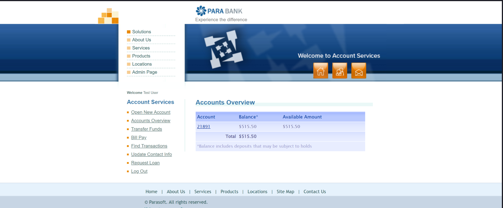
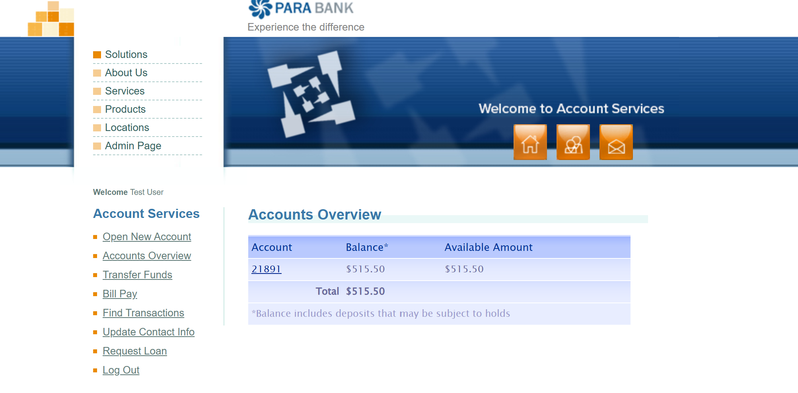

# 🐞 BUG-01 · El inicio de sesión acepta credenciales inválidas y muestra los datos de una cuenta

| Campo | Detalle |
|---|---|
| **ID** | BUG-01 |
| **Estado** | Abierto |
| **Severidad** | **Crítica** (seguridad: acceso a datos de una cuenta sin credenciales válidas) |
| **Prioridad** | P1 |
| **Módulo** | Autenticación · Inicio de sesión |
| **Ambiente** | https://parabank.parasoft.com · Microsoft Edge 154 · Windows 11 |
| **Detectado por** | Prueba automatizada (escenarios "contraseña incorrecta" y "usuario inexistente") |
| **Reportado por** | Yaquelin Rugel · 06-10-2026 |
|  **Reproducibilidad** | 2 de 2 ejecuciones automatizadas · Reproducido manualmente el 06-10-2026 |

## Resumen
Al iniciar sesión con una contraseña incorrecta, o con un usuario que no existe, ParaBank no muestra un error:
redirige a "Accounts Overview" con la sesión iniciada como "Test User" y muestra el número y el saldo de una cuenta.

## Pasos para reproducir
1. Ir a https://parabank.parasoft.com/parabank/index.htm (sin sesión iniciada)
2. En "Username" escribir `john` y en "Password" escribir `clave_mala`
3. Hacer clic en "Log In"
4. Repetir con el usuario `usuario_no_existe_123` y la contraseña `demo`

## Resultado esperado
Se muestra el mensaje "The username and password could not be verified." y el usuario permanece en la página de inicio, sin acceso.

## Resultado obtenido
- Se abre "Accounts Overview" con el mensaje "Welcome Test User".
- Se muestran la cuenta 21891 y un saldo de $515.50.
- Ocurre tanto con contraseña incorrecta como con usuario inexistente.

## Evidencia
- Escenarios que lo detectan: `src/test/resources/features/login.feature`, etiqueta `@BUG-01`.
- Captura automática tomada por el hook `@After` al fallar la prueba "contraseña incorrecta":

- Reproducción manual con `john` / `clave_mala`:

**Conclusión:** el inicio de sesión no valida las credenciales; cualquier combinación de usuario y contraseña no vacíos da acceso.

**Conclusión:** el inicio de sesión no valida las credenciales; cualquier combinación de usuario y contraseña no vacíos da acceso.

## Impacto
Cualquier persona puede acceder a datos bancarios (número de cuenta y saldo) sin credenciales válidas.
Es un defecto de seguridad en el control de acceso.

## Contexto
ParaBank es un sitio público de demostración cuya base de datos se reinicia periódicamente.
El comportamiento se registra tal como se observó en la fecha indicada.