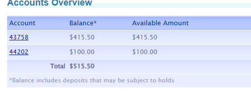
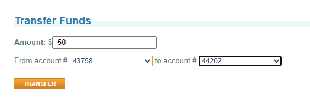
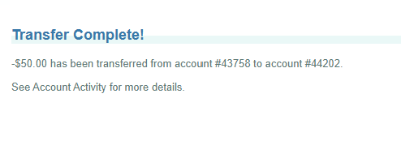
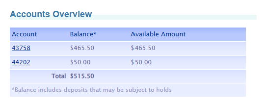

# 🐞 BUG-02 · Una transferencia con monto negativo mueve el dinero en sentido contrario

| Campo | Detalle |
|---|---|
| **ID** | BUG-02 |
| **Estado** | Abierto |
| **Severidad** | **Crítica** (permite sacar dinero de la cuenta de destino) |
| **Prioridad** | P1 |
| **Módulo** | Transferencias (Transfer Funds) |
| **Ambiente** | https://parabank.parasoft.com · Microsoft Edge 154 · Windows 11 |
| **Detectado por** | Prueba automatizada de valores límite · escenario "Se rechaza una transferencia con monto negativo" |
| **Reportado por** | Yaquelin Rugel · 07-10-2026 |
| **Reproducibilidad** | 1 de 1 ejecución automatizada · Reproducido manualmente el 07-10-2026 |

## Resumen
ParaBank acepta transferencias con monto negativo. Al transferir -$50.00 desde la cuenta A hacia la cuenta B,
el sistema **resta $50.00 a la cuenta de destino y los suma a la cuenta de origen**. Además, el historial de la
cuenta de destino registra la operación como "Funds Transfer Received" en la columna de créditos.

## Pasos para reproducir
1. Registrar un cliente nuevo y abrir una cuenta SAVINGS (Open New Account)
2. En Accounts Overview, anotar los saldos: cuenta 43758 = $415.50 y cuenta 44202 = $100.00
3. Ir a Transfer Funds, ingresar el monto `-50`, origen `43758` y destino `44202`
4. Hacer clic en "Transfer"
5. Revisar Accounts Overview y la actividad de la cuenta 44202

## Resultado esperado
La transferencia se rechaza con un mensaje que indique que el monto debe ser mayor que cero. Los saldos no cambian.

## Resultado obtenido
- Se muestra "Transfer Complete!" con el texto "-$50.00 has been transferred from account #43758 to account #44202."
- Saldos después de la operación:

| Cuenta | Antes | Después | Cambio |
|---|---|---|---|
| 43758 (origen) | $415.50 | $465.50 | +$50.00 |
| 44202 (destino) | $100.00 | $50.00 | −$50.00 |

- En la actividad de la cuenta 44202, la operación aparece como "Funds Transfer Received" por -$50.00 en la columna **Credit (+)**, cuando en realidad fue un débito.

## Evidencia

## Impacto
Un cliente puede retirar dinero de la cuenta de destino usando una transferencia negativa. Si la cuenta de
destino pertenece a otra persona, equivale a sacar dinero de una cuenta ajena. El historial engañoso dificulta
detectarlo. El total entre ambas cuentas se mantiene ($515.50): el dinero no se crea ni se pierde, se mueve en sentido contrario.

## Sugerencia
Validar en el servidor (no solo en el formulario) que el monto sea mayor que cero.

## Contexto
ParaBank es un sitio público de demostración. El comportamiento se registra tal como se observó en la fecha indicada.
