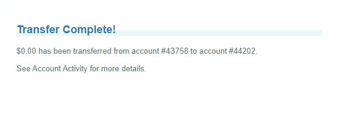
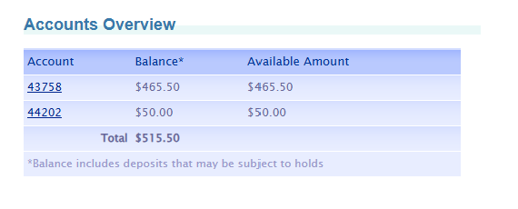
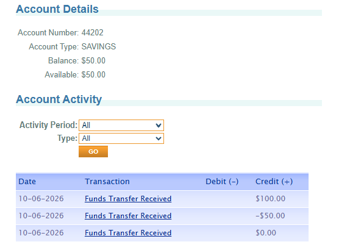

# 🐞 BUG-03 · Se aceptan transferencias de $0.00 y se registran en el historial

| Campo | Detalle |
|---|---|
| **ID** | BUG-03 |
| **Estado** | Abierto |
| **Severidad** | **Baja** (no mueve dinero) |
| **Prioridad** | P3 |
| **Módulo** | Transferencias (Transfer Funds) |
| **Ambiente** | https://parabank.parasoft.com · Microsoft Edge 154 · Windows 11 |
| **Detectado por** | Prueba automatizada de valores límite · escenario "Se rechaza una transferencia con monto cero" |
| **Reportado por** | Yaquelin Rugel · 07-10-2026 |
| **Reproducibilidad** | 1 de 1 ejecución automatizada · Reproducido manualmente el 07-10-2026 |

## Resumen
ParaBank acepta una transferencia de $0.00, muestra "Transfer Complete!" y guarda una transacción de $0.00
en el historial de la cuenta de destino.

## Pasos para reproducir
1. Con un cliente que tenga dos cuentas (43758 y 44202), ir a Transfer Funds
2. Ingresar el monto `0`, origen `43758` y destino `44202`
3. Hacer clic en "Transfer"
4. Revisar Accounts Overview y la actividad de la cuenta 44202

## Resultado esperado
La transferencia se rechaza con un mensaje que indique que el monto debe ser mayor que cero.

## Resultado obtenido
- Se muestra "Transfer Complete!" con el texto "$0.00 has been transferred from account #43758 to account #44202."
- Los saldos no cambian (43758 = $465.50 · 44202 = $50.00).
- En la actividad de la cuenta 44202 aparece una transacción "Funds Transfer Received" por $0.00.

## Evidencia

## Impacto
No hay pérdida de dinero, pero se registran operaciones sin sentido que ensucian el historial del cliente,
los reportes y las auditorías.
