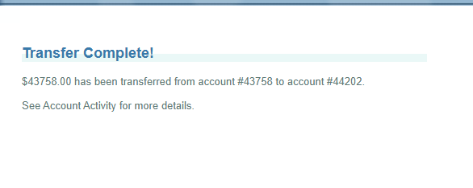
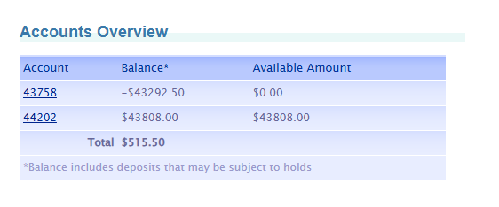

# 🔎 OBS-01 · Se permite transferir más que el saldo, sin límite, aunque el disponible es $0.00

| Campo | Detalle |
|---|---|
| **ID** | OBS-01 |
| **Tipo** | Observación · **Riesgo alto** · Requiere definición del Product Owner |
| **Módulo** | Transferencias (Transfer Funds) |
| **Ambiente** | https://parabank.parasoft.com · Microsoft Edge 154 · Windows 11 |
| **Detectado por** | Prueba automatizada de valores límite · escenario "Se rechaza transferir más que el saldo disponible" |
| **Reportado por** | Yaquelin Rugel · 07-10-2026 |

## Por qué es una observación y no un defecto
No existe un requisito que indique si ParaBank permite sobregiro. Algunos bancos lo permiten de forma intencional.
Sin embargo, el comportamiento observado presenta un riesgo alto y se escala para su definición.

## Lo observado
- **Automatizado:** una transferencia de (saldo + $0.01) fue aceptada.
- **Manual:** desde la cuenta 43758, con saldo de $465.50, se transfirieron **$43,758.00** a la cuenta 44202
  (al ingresar el monto se escribió por error el número de cuenta; el sistema lo aceptó igualmente).

| Cuenta | Antes | Después |
|---|---|---|
| 43758 (origen) | $465.50 | −$43,292.50 |
| 44202 (destino) | $50.00 | $43,808.00 |

- Después de la operación, Accounts Overview muestra **Available Amount = $0.00** para la cuenta 43758:
  el sistema reconoce que no hay saldo disponible, pero no lo validó al aceptar la transferencia.

## Evidencia

## Preguntas para el Product Owner
1. ¿ParaBank permite sobregiro en las cuentas CHECKING?
2. Si lo permite, ¿cuál es el límite? Hoy no existe ninguno.
3. ¿Por qué la transferencia se acepta si el "Available Amount" es $0.00?

## Recomendación
Si el sobregiro no está permitido, reclasificar como defecto de severidad Crítica.
